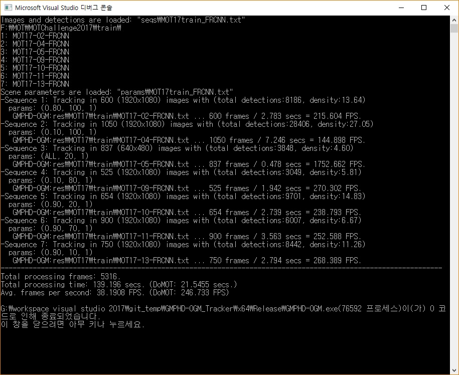

# 1. Introduction
**An Online Multi-Object Tracking (MOT) Method with the GMPHD Filter and Occlusion Group Management (OGM).**

To implement a highly practical MOT method, online approach and real-time speed are required.

  + Online Process: The Gaussian mixture probability density (GMPHD) filter was exploited as a base model.
  + Real-time Speed: We only used bounding box information (x, y, width, height).

Tracking-by-detection paradigm.

  + In this project, the public detection results on the [MOT15](https://motchallenge.net/data/2D_MOT_2015/) (ACF) and [MOT17](https://motchallenge.net/data/MOT17/) (DPM, FRCNN, SDP) datasets are used as inputs of the GMPHD-OGM tracker.

Our main contributions are as follows:
  + An effective extension of the conventional GMMPHD filter from the original domain radar/sonar systems to video systems, consisting of:
    + A hierarchical data association strategy: detection-to-track and track-to-track associations.
    + An occlusion group management scheme: merge and occlusion energy minimization.
  + The GMPHD-OGM tracker achieved the competitive tracking accurary and real-time speed (>30 FPS).
    + Experimental results was presented in the [arxiv](https://arxiv.org/abs/1907.13347) and [MOTChallenge](https://motchallenge.net/) in detail.

# 2. User guide

## Development Environment
Windows 10  (64 bit) <br>
Visual Studio 2015  (64 bit)

#### Programming Languages
Visual C/C++

#### Libaries
[OpenCV 3.4.1](https://www.opencv.org/opencv-3-4-1.html) and 
[boost 1.61.0 (Windows Binaries)](https://sourceforge.net/projects/boost/files/boost-binaries/1.61.0/) 
were used to implement the GMPHD-OGM tracker.

## Files
```
demo_GMPHD-OGM.cpp
```
includes **the main function**.

```
GMPHD_OGM.h, GMPHD_OGM.cpp
```
is a class implementation of the GMPHD-OGM tracker.
```
HungarianAlgorithm.h, HungarianAlgorithm.cpp
```
is a class implementation of the Hungarian Algorithm refering to [#mcximing/hungarian-algorithm-cpp](https://github.com/mcximing/hungarian-algorithm-cpp)

```
GMPHD-OGM.sln, GMPHD-OGM.vcxproj, GMPHD-OGM.vcxproj.filters, stdafx.h
```
are **solution file for the project**, VS project file, VS project filter file, and precompiled header including essential header files, repectively.

## How to run

1. Open the solution file (**GMPHD-OGM.sln**)
2. Link and include OpenCV3.4.1 and boost1.61.0 libraries to the project.
3. Press Ctrl+F5 in Release mode (64 bit)

## Input
1. Images and public detection results
>> Download the [MOTChallenge](https://motchallenge.net/) datasets.

2. Sequence List files of the image sequences
>> Users should specify the dataset path and sequences' names in the sequence list file.
```
e.g., GMPHD-OGM\seqs\MOT17train_DPM.txt
F:\MOT\MOTChallenge2017\train\
MOT17-02-FRCNN
MOT17-04-FRCNN
MOT17-05-FRCNN
MOT17-09-FRCNN
MOT17-11-FRCNN
MOT17-13-FRCNN
```
3. Parameter files
>> More details of the parameters will be updated soon.
```
e.g., GMPHD-OGM\params\MOT17train_DPM.txt
```
4. Please check the input files' locations in the main fuction ([demo_GMPHD-OGM.cpp](GMPHD-OGM/demo_GMPHD-OGM.cpp))
```
// demo_GMPHD-OGM.cpp
int main()
{
string seqList = "seqs\MOT17train_DPM.txt";
string seqList = "params\MOT17train_DPM.txt";
...
```

## Output
1. Log messages in Console


2. The output file format is compatible with [MOTChallenge](https://motchallenge.net/instructions/).

>>The tracking results files are saved as<br>
[project home]\GMPHD-OGM\res\[benchmark name]\[train or test]\[sequence name].txt
```
e.g., [project home]\GMPHD-OGM\res\MOT15\train\Venice-2.txt
```
## ETC.
We are only providing the parameters of the GMPHD-OGM tracker on the training sequences.

# 3. References

[1] Ba-Ngu Vo and Wing-Kin Ma, "The Gaussian Mixture Probability Hypothesis Density Filter," _IEEE Trans. Signal Process._, vol. 54, no. 11, pp. 4091–4104, Oct. 2006. [[paper]](https://ieeexplore.ieee.org/document/1710358)

[2] Young-min Song and Moong Jeon, "Online Multiple Object Tracking with the Hierarchically Adopted GM-PHD Filter Using Motion and Appearance," in _Proc. IEEE Int. Conf. Consum. Electron.-Asia (ICCE-Asia)_, pp. 1--4, Oct. 2016. [[paper]](https://ieeexplore.ieee.org/document/7804800)

[3] Young-min Song, Young-chul Yoon, Kwangjin Yoon, and Moongu Jeon, "Online and Real-Time Tracking with the GM-PHD Filter
using Group Management and Relative Motion Analysis," in _Proc. IEEE Int. Workshop Traffic Street Surveill. Safety Secur. (AVSS)_, Nov. 2018. [[paper]](https://ieeexplore.ieee.org/document/8639427)

[4] Young-mins Song, Kwangjin Yoon, Young-chul Yoon, Kin Choon Yow, and Moongu Jeon, "Online Multi-Object Tracking Framework with the GMPHD Filter and Occlusion Group Management," [Online]. Available: https://arxiv.org/abs/1907.13347, Jul. 2019.

## Citation [[arxiv]](https://arxiv.org/abs/1907.13347)

```
\bibitem{gmphdogm} Y. Song, K. Yoon, Y-C. Yoon, K. C. Yow, and M. Jeon, 
``Online Multi-Object Tracking Framework with the GMPHD Filter and Occlusion Group Management,'' 
[Online]. Available: https://arxiv.org/abs/1907.13347, Jul. 2019.
```

## 5. [License](https://github.com/SonginCV/GMPHD-GMMA/blob/master/LICENSE)
BSD 2-Clause License
